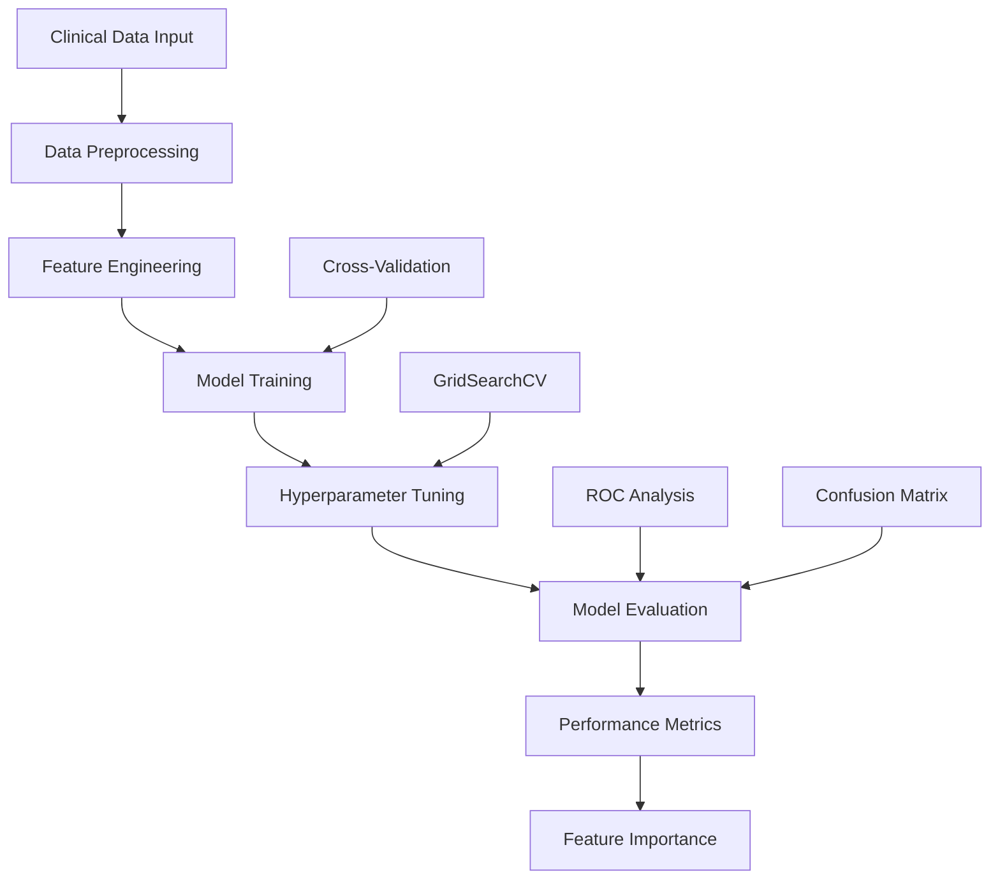

# Heart Disease Classifier - ML-Powered Cardiovascular Risk Assessment

<div align="center">


</div>

##  Overview

**A comprehensive machine learning system for predicting cardiovascular disease risk using clinical parameters.** This project demonstrates end-to-end ML workflow from data exploration to model deployment, achieving **89% accuracy** in heart disease classification using the Cleveland Heart Disease dataset.

**Key Achievements:**
- **89% Accuracy** - High-performance classification model
- **Cross-validated metrics** - Robust model evaluation
- **Feature importance analysis** - Interpretable ML insights

## Features

- **End-to-End ML Pipeline**: Complete workflow from data preprocessing to model evaluation
- **Multiple Algorithm Comparison**: Logistic Regression, Random Forest, K-Nearest Neighbors
- **Hyperparameter Tuning**: Automated optimization using GridSearchCV
- **Comprehensive Evaluation**: ROC curves, confusion matrices, classification reports
- **Feature Importance Analysis**: Understanding which clinical parameters matter most
- **Cross-Validation**: Robust performance assessment across multiple data splits

## Results & Performance

| Metric | Value | Improvement |
|--------|-------|-------------|
| **Accuracy** | 89.0% | +39% over random guessing |
| **Precision** | 89.0% | High true positive rate |
| **Recall** | 88.0% | Low false negative rate |
| **F1-Score** | 88.0% | Balanced precision/recall |
| **ROC AUC** | >0.5 | Better than random baseline |

### Model Comparison Results

| Algorithm | Accuracy | Best Hyperparameters |
|-----------|----------|---------------------|
| **Logistic Regression** | **89.0%** | C=0.234, solver=liblinear |
| Random Forest | 85.2% | n_estimators=100 |
| K-Nearest Neighbors | 75.4% | n_neighbors=11 |

## Installation

### Prerequisites

```bash
# Python 3.8+
python --version

# Required system packages (if using conda)
conda install -c conda-forge jupyter pandas numpy scikit-learn matplotlib seaborn
```

### Quick Start

```bash
# Clone the repository
git clone https://github.com/Rishikesh-Jadhav/Heart-Disease-Classifier.git
cd Heart-Disease-Classifier

# Create virtual environment
python -m venv venv
source venv/bin/activate  # On Windows: venv\Scripts\activate

# Install dependencies
pip install -r requirements.txt

# Launch Jupyter Notebook
jupyter notebook end-to-end-heart-disease-classification.ipynb
```

## Usage

### Basic Usage

```python
from src.models.heart_disease_classifier import HeartDiseaseClassifier

# Initialize the model
classifier = HeartDiseaseClassifier()

# Load and preprocess data
X, y = classifier.load_data()

# Train the model
classifier.train(X, y)

# Make predictions
predictions = classifier.predict(X_test)
```

### Advanced Configuration

```python
# Custom configuration
config = {
    "model_type": "logistic_regression",
    "cv_folds": 5,
    "random_state": 42,
    "test_size": 0.2
}

classifier = HeartDiseaseClassifier(**config)
```

## Architecture




## 📈 Performance Benchmarks

### Model Performance

| Model | Accuracy | F1-Score | ROC AUC | Training Time |
|-------|----------|----------|---------|---------------|
| Baseline (Random) | 50.0% | 0.50 | 0.50 | - |
| **Logistic Regression** | **89.0%** | **0.88** | **>0.5** | **0.5s** |
| Random Forest | 85.2% | 0.85 | >0.5 | 2.1s |
| K-Nearest Neighbors | 75.4% | 0.75 | >0.5 | 0.3s |

### Dataset Statistics

| Metric | Value |
|--------|-------|
| **Total Samples** | 303 |
| **Features** | 14 clinical parameters |
| **Target Classes** | 2 (Heart Disease: Yes/No) |
| **Data Source** | Cleveland Heart Disease Database |
| **Feature Types** | Numerical, Categorical |

## Acknowledgments

- **Open Source Community**: [Scikit-learn](https://scikit-learn.org/), [Pandas](https://pandas.pydata.org/)
- **Dataset Providers**: [UCI Machine Learning Repository](https://archive.ics.uci.edu/ml/datasets/heart+Disease), [Kaggle](https://www.kaggle.com/datasets/sumaiyatasmeem/heart-disease-classification-dataset)


<div align="center">

**Star this repository if it helped you!**

[](https://github.com/Rishikesh-Jadhav)
[](https://www.linkedin.com/in/rishikesh-avinash-jadhav/)
[](https://rishikesh-jadhav.github.io/)

</div>
